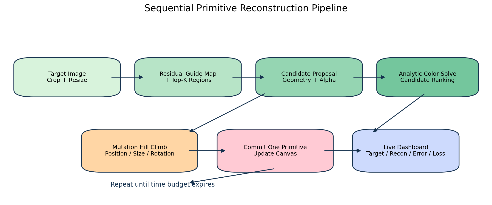
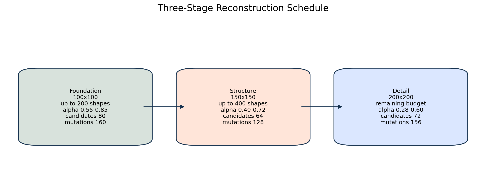
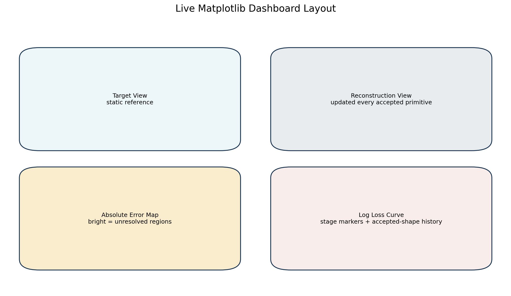

# Sequential Perceptual Primitive Reconstruction

## Overview
This project reconstructs images with explicit alpha-blended geometric primitives rather than latent generative models. The final image is built one primitive at a time through a greedy search loop:
- sample candidate centers from the current highest-error regions
- generate geometry around those centers
- solve each candidate color analytically
- hill-climb the winning geometry
- commit the single best new primitive to the canvas

The current best implementation is the April 1, 2026 tuned three-stage sequential reconstructor. A later detail-stage LAB-ranking experiment was tested and rejected because it reduced throughput and worsened reconstruction quality.

## Pipeline


## Stage Schedule


## Final Implementation
The active best branch uses:
- analytic color solving instead of learned color updates
- RGB MSE for candidate ranking and commit acceptance
- higher-opacity early stages so large color masses lock in quickly
- larger mutation radii so geometry can move meaningfully at each stage
- high-frequency-aware residual guidance in the detail pass, but still blended with global residual energy
- ellipses as the dominant primitive, with angular shapes introduced only when structure genuinely supports them

Important note:
- the strongest saved code snapshot is tagged `best-sequential-tuned-2026-04-01`
- an isolated grape benchmark on this code family previously reached `rgb_mse = 0.013905`, `ssim = 0.55509`, and `gradient_corr = 0.69528`
- the latest full-suite sweep below was rerun after final cleanup and keeps one current output folder per target

## Latest Full Benchmark Suite
Settings used for every target:
- runtime: `5 minutes`
- resolution: `200x200`
- shape budget: `1500`
- seed: `42`
- fit mode: `crop`

Average metrics across the full latest target suite:
- `rgb_mse = 0.007529`
- `ssim = 0.74898`
- `psnr = 25.900 dB`
- `lab_mse = 36.489`
- `gradient_mse = 0.002770`
- `gradient_mae = 0.02306`
- `gradient_corr = 0.76832`
- `accepted_polygons = 377.43`


| Target | RGB MSE | SSIM | Gradient Corr | Output | Metrics |
| --- | ---: | ---: | ---: | --- | --- |
| `face.png` | `0.003907` | `0.84210` | `0.92674` | [stage_detail.png](C:\Users\ahada\Documents\abdulahad\evolutionary-art\python\outputs\stage_checkpoints\face_20260401_173448\stage_detail.png) | [run_metrics.json](C:\Users\ahada\Documents\abdulahad\evolutionary-art\python\outputs\stage_checkpoints\face_20260401_173448\run_metrics.json) |
| `grape.jpg` | `0.021227` | `0.43940` | `0.53904` | [stage_detail.png](C:\Users\ahada\Documents\abdulahad\evolutionary-art\python\outputs\stage_checkpoints\grape_20260401_173957\stage_detail.png) | [run_metrics.json](C:\Users\ahada\Documents\abdulahad\evolutionary-art\python\outputs\stage_checkpoints\grape_20260401_173957\run_metrics.json) |
| `heart.png` | `0.001956` | `0.88783` | `0.93074` | [stage_detail.png](C:\Users\ahada\Documents\abdulahad\evolutionary-art\python\outputs\stage_checkpoints\heart_20260401_174506\stage_detail.png) | [run_metrics.json](C:\Users\ahada\Documents\abdulahad\evolutionary-art\python\outputs\stage_checkpoints\heart_20260401_174506\run_metrics.json) |
| `internet_graphic.jpg` | `0.002101` | `0.71917` | `0.62341` | [stage_detail.png](C:\Users\ahada\Documents\abdulahad\evolutionary-art\python\outputs\stage_checkpoints\internet_graphic_20260401_175013\stage_detail.png) | [run_metrics.json](C:\Users\ahada\Documents\abdulahad\evolutionary-art\python\outputs\stage_checkpoints\internet_graphic_20260401_175013\run_metrics.json) |
| `internet_landscape.jpg` | `0.000052` | `0.97600` | `0.85681` | [stage_detail.png](C:\Users\ahada\Documents\abdulahad\evolutionary-art\python\outputs\stage_checkpoints\internet_landscape_20260401_175520\stage_detail.png) | [run_metrics.json](C:\Users\ahada\Documents\abdulahad\evolutionary-art\python\outputs\stage_checkpoints\internet_landscape_20260401_175520\run_metrics.json) |
| `internet_portrait.jpg` | `0.021521` | `0.43420` | `0.52817` | [stage_detail.png](C:\Users\ahada\Documents\abdulahad\evolutionary-art\python\outputs\stage_checkpoints\internet_portrait_20260401_180027\stage_detail.png) | [run_metrics.json](C:\Users\ahada\Documents\abdulahad\evolutionary-art\python\outputs\stage_checkpoints\internet_portrait_20260401_180027\run_metrics.json) |
| `logo.png` | `0.001939` | `0.94415` | `0.97332` | [stage_detail.png](C:\Users\ahada\Documents\abdulahad\evolutionary-art\python\outputs\stage_checkpoints\logo_20260401_180536\stage_detail.png) | [run_metrics.json](C:\Users\ahada\Documents\abdulahad\evolutionary-art\python\outputs\stage_checkpoints\logo_20260401_180536\run_metrics.json) |

## Setup
Requirements:
- Python `3.14+`
- `uv`
- Node.js if you want repomix snapshots

```powershell
Set-Location python
uv sync
```

## Main Commands
Run a single reconstruction:

```powershell
Set-Location python
uv run python .\run.py .\targets\grape.jpg --no-display --minutes 5 --resolution 200 --polygons 1500 --seed 42 --fit-mode crop --no-prompt
```

Run the interactive live dashboard:

```powershell
Set-Location python
uv run python .\run.py .\targets\internet_graphic.jpg --minutes 5 --resolution 200 --polygons 1500 --seed 42 --fit-mode crop --no-prompt
```

The live dashboard now shows:
- target image
- current reconstruction
- absolute error map
- log-scaled RGB MSE curve with stage markers

Dashboard layout:



Record the internet demo sequence as an animated visualization:

```powershell
Set-Location python
uv run python .\scripts\render_internet_demo.py --minutes 1.0 --frame-stride 2 --frame-duration-ms 100
```

The recorder saves:
- a combined demo GIF: [internet_sequence_live_demo.gif](C:\Users\ahada\Documents\abdulahad\evolutionary-art\python\outputs\demo_viz\internet_sequence_live_demo.gif)
- per-target demo GIFs and JSON verification metadata in [demo_viz](C:\Users\ahada\Documents\abdulahad\evolutionary-art\python\outputs\demo_viz)

Recorded demo preview:


Rebuild the repomix snapshot:

```powershell
Set-Location python
uv run python .\scripts\build_python_repomix.py
```

Regenerate the documentation figures:

```powershell
Set-Location python
uv run python .\scripts\generate_doc_figures.py
```

## Verification
Compile:

```powershell
Set-Location python
$env:PYTHONPATH = (Get-Location).Path
uv run python -m compileall .\src .\tests .\run.py .\final_reconstruct_eval.py .\scripts\build_python_repomix.py
```

Focused regression suite:

```powershell
Set-Location python
$env:PYTHONPATH = (Get-Location).Path
uv run pytest .\tests\test_refiner_live.py .\tests\test_live_optimizer.py -q
```

The live demo recorder performs its own verification too:
- it confirms the dashboard received at least one update per accepted primitive
- it confirms the recorded loss decreases from the first captured state to the final captured state
- it writes per-target verification JSON files alongside each demo GIF

## Docs
- [academic_paper.md](C:\Users\ahada\Documents\abdulahad\evolutionary-art\docs\academic_paper.md): standalone implementation report and benchmark analysis
- [approach_retrospective.md](C:\Users\ahada\Documents\abdulahad\evolutionary-art\docs\approach_retrospective.md): best branch, failed branches, and deviation analysis
