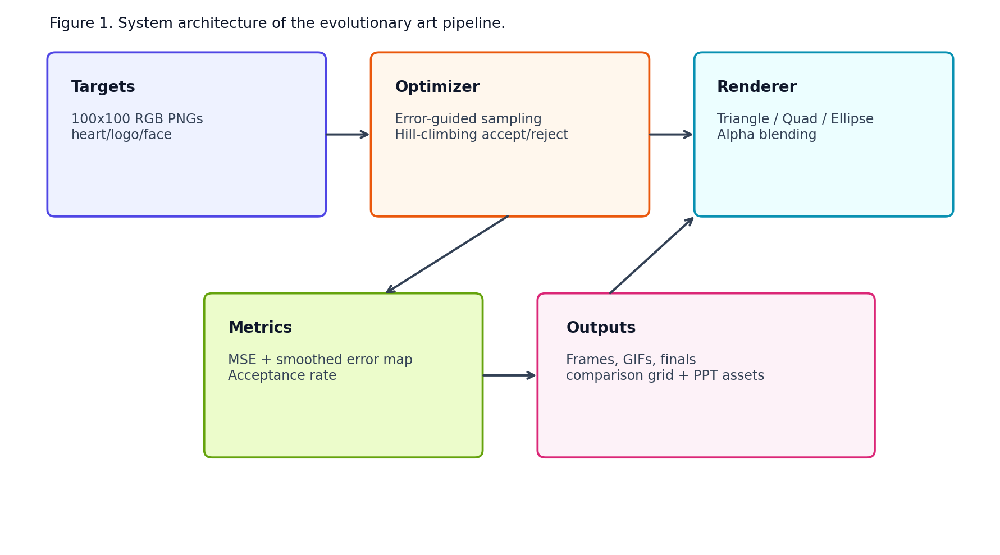

# Attention-Guided Evolutionary Art: Technical Report

## Abstract
This report documents a modular evolutionary image reconstruction system that approximates RGB targets at 200x200 by default, with a 300x300 opt-in mode. The method combines perceptual LAB-space optimization, attention-weighted proposal sampling, adaptive alpha search, and phase-aware geometry behavior. A six-variant population of concurrent hill climbers improves exploration and periodically recombines states through barrier-synchronized coordination. An interactive four-panel live interface exposes segmentation, error diagnostics, acceptance dynamics, and multi-variant progress in real time. New output tooling records log-spaced checkpoints, generates quality-vs-budget curves, and compares naive and improved optimizers on identical targets. Experiments on three custom internet images show substantial and consistent quality gains from the improved method.

## 1. Introduction
Evolutionary reconstruction with explicit primitives is a practical setting for studying optimization dynamics, perceptual error metrics, and explainable generation behavior. Unlike black-box generative models, this approach keeps the state transition interpretable: every accepted polygon has a measurable effect on a scalar objective.

This implementation targets four goals:
1. Perceptual fidelity through LAB-space reasoning.
2. Efficient search through attention-guided proposal distributions.
3. Better global exploration through population-assisted local search.
4. Usable diagnostics through live visualization and post-run analysis tools.

## 2. Objective and Notation
Let target image $T \in [0,1]^{H \times W \times 3}$ and current canvas $C \in [0,1]^{H \times W \times 3}$.

The baseline pixel-wise error map is:

$$
E_{y,x} = \sum_{c=1}^{3} (T_{y,x,c} - C_{y,x,c})^2
$$

The optimizer tracks perceptual LAB MSE as the primary acceptance objective:

$$
\mathcal{L}_{\text{LAB}}(T, C) = \frac{1}{3HW} \sum_{y=1}^{H}\sum_{x=1}^{W}\sum_{k=1}^{3} \left(\mathrm{LAB}(T)_{y,x,k} - \mathrm{LAB}(C)_{y,x,k}\right)^2
$$

The attention map is derived from smoothed error and normalized into a sampling distribution $p(y, x)$ used for proposal centers.

## 3. System Architecture
Figure 1 summarizes the modular pipeline from preprocessing to rendering and runtime instrumentation.



Core implementation units:
- `python/src/preprocessing.py`: resolution handling, pyramid, MiniBatchKMeans LAB segmentation, Sobel structure/orientation, complexity score.
- `python/src/polygon.py`: shape generation (triangle, quadrilateral, ellipse), orientation-aware placement, color seeding.
- `python/src/renderer.py`: mask rasterization and alpha blending.
- `python/src/optimizer.py`: single-variant hill climbing with schedule-aware loss and maintenance operators.
- `python/src/population.py`: six-worker population coordination and recombination.
- `python/src/display.py`: interactive multi-panel runtime display.
- `python/src/output_tools.py`: log checkpoints, quality-vs-budget plots, CSV export.
- `python/compare.py`: naive-vs-improved paired experiments.

## 4. Methodology
### 4.1 Preprocessing and adaptive recommendations
Preprocessing is performed at a base resolution of 200 by default, with 300 as an explicit override. The target is represented as:
- Four-level Gaussian pyramid.
- LAB segmentation via MiniBatchKMeans.
- Structure magnitude and gradient orientation using `skimage.filters.sobel_h` and `sobel_v`.

Derived metadata drives automatic recommendations:
- Complexity score in $[0,1]$.
- Recommended polygon budget.
- Recommended size schedule across coarse, structural, and detail phases.

### 4.2 Candidate generation and rendering
Each iteration samples a center from the normalized attention map, then proposes one shape from the cycle:
- Triangle
- Quadrilateral
- Ellipse

Rendering uses standard alpha compositing over the shape mask $M$:

$$
C_{\text{new}}[M] = \alpha\,\mathbf{c} + (1-\alpha)\,C[M]
$$

where $\mathbf{c}$ is the candidate RGB color.

### 4.3 Perceptual schedule and acceptance
The optimizer uses a sigmoid coarse-to-fine transition:

$$
w_{\text{fine}}(i) = \sigma\left(8\left(\frac{i}{N} - 0.4\right)\right), \quad
w_{\text{coarse}}(i) = 1 - w_{\text{fine}}(i)
$$

This prioritizes global composition early and transitions to detail-focused behavior after approximately 40% of planned iterations.

Acceptance is strict-improvement hill climbing: a proposal is retained only when perceptual objective decreases.

### 4.4 Local operators and maintenance
The improved optimizer integrates several operators:
- Adaptive alpha search over $\{0.15, 0.40, 0.70\}$ per candidate.
- Structure-aware shape orientation and type bias.
- Optional polygon splitting when child proposals improve loss.
- Palette refinement every 500 accepted polygons.
- Periodic death/replacement of low-contribution polygons.

### 4.5 Population-assisted hill climbing
Six variant optimizers run concurrently with personality differences (size bias, structure bias, maintenance aggressiveness, and random-placement behavior). A synchronization barrier enforces periodic coordinated recombination, where top-performing variants contribute candidate polygons to update the primary solution when beneficial.

### 4.6 Live visualization and controls
The runtime interface presents:
- Target image with optional segmentation overlay.
- Error/attention panel with multiple diagnostic modes.
- Evolving reconstruction and acceptance/rejection flash indicator.
- Statistical panel with primary and best-variant MSE, acceptance rate, throughput, diversity, recombination count, and ETA estimate.

Keyboard controls support pause/resume, mode switching, screenshots, and variant stream selection.

### 4.7 Output analysis tooling
The run pipeline emits artifacts for quantitative review:
- Log-spaced checkpoints (`iter_0001`, `0010`, `0050`, `0100`, ...).
- Evolution montage grid.
- Quality-vs-budget curve and CSV data.
- Naive-vs-improved split comparison with overlaid MSE trajectories.

## 5. Experimental Setup
### 5.1 Inputs
Experiments include built-in targets and three custom internet images:
- `python/targets/internet_portrait.jpg`
- `python/targets/internet_landscape.jpg`
- `python/targets/internet_graphic.jpg`

### 5.2 Commands
Live short-run artifact generation (auto-close):

```powershell
uv run python run.py .\targets\internet_portrait.jpg --fit-mode crop --iterations 1200 --close-after-seconds 8 --output-prefix internet_portrait
uv run python run.py .\targets\internet_landscape.jpg --fit-mode crop --iterations 1200 --close-after-seconds 8 --output-prefix internet_landscape
uv run python run.py .\targets\internet_graphic.jpg --fit-mode crop --iterations 1200 --close-after-seconds 8 --output-prefix internet_graphic
```

Controlled paired comparison:

```powershell
uv run python compare.py .\targets\internet_portrait.jpg --iterations 800 --no-display --output .\outputs\internet_portrait_compare.png
uv run python compare.py .\targets\internet_landscape.jpg --iterations 800 --no-display --output .\outputs\internet_landscape_compare.png
uv run python compare.py .\targets\internet_graphic.jpg --iterations 800 --no-display --output .\outputs\internet_graphic_compare.png
```

## 6. Results
### 6.1 Live progression summaries
Short live sessions produced stable descent and artifact output for all internet images.

| Target Prefix | Final Iteration | Accepted Polygons | Final LAB MSE |
| --- | ---: | ---: | ---: |
| internet_portrait | 123 | 109 | 139.3204 |
| internet_landscape | 134 | 120 | 6.0246 |
| internet_graphic | 70 | 70 | 66.7524 |

These values were recorded from the run summaries printed by `python/run.py`.

### 6.2 Quality-vs-budget behavior
The budget analysis traces expected monotonic improvement with additional accepted polygons.

Portrait (`internet_portrait_quality_vs_budget.csv`):
- 10 polygons: 891.0534
- 20 polygons: 799.4224
- 50 polygons: 525.6117
- 100 polygons: 290.5489

Landscape (`internet_landscape_quality_vs_budget.csv`):
- 10 polygons: 189.2059
- 20 polygons: 118.0982
- 50 polygons: 30.9524
- 100 polygons: 10.8714

Graphic (`internet_graphic_quality_vs_budget.csv`):
- 10 polygons: 674.4030
- 20 polygons: 490.4101
- 50 polygons: 158.7411

Figures:
- 
- 
- 

### 6.3 Naive vs improved comparisons
At equal iteration budget (800), improved optimization consistently dominates naive search.

| Target | Naive Final LAB MSE | Improved Final LAB MSE | Absolute Gap |
| --- | ---: | ---: | ---: |
| Portrait | 555.1732 | 114.7067 | 440.4665 |
| Landscape | 208.1470 | 1.9645 | 206.1825 |
| Graphic | 359.3228 | 14.0109 | 345.3118 |

Comparison visualizations:
- 
- 
- 

Evolution checkpoint montages:
- 
- 
- 

### 6.4 Interpretation
The naive baseline tends to accept noisy color placements and plateaus at high error. The improved pipeline benefits from LAB-guided color initialization, structure-aware geometry, and schedule-aware optimization, yielding order-of-magnitude lower final error on two of three internet examples and strong reduction on the portrait case.

## 7. Validation and Test Coverage
The project includes unit and behavioral tests spanning core metrics, rendering, optimizer behavior, population logic, live display lifecycle, and Phase 6 output tooling.

Representative files:
- `python/tests/test_mse.py`
- `python/tests/test_renderer.py`
- `python/tests/test_optimizer.py`
- `python/tests/test_phase4_population.py`
- `python/tests/test_phase5_live.py`
- `python/tests/test_phase6_outputs.py`

Current suite status in this workspace: 20 tests passed.

## 8. Limitations and Threats to Validity
1. Greedy acceptance can still stall near local minima, especially with cluttered or highly textured scenes.
2. Reported short live runs are constrained by auto-close for interactive verification; longer runs will generally reduce MSE further.
3. Naive baseline intentionally omits guidance and adaptive policies; gap magnitude depends on this baseline definition.
4. Perceptual LAB MSE is more meaningful than RGB MSE here, but it is not equivalent to full human perceptual quality.

## 9. Conclusion
The system demonstrates that combining perceptual objectives, attention-guided proposals, and coordinated population search materially improves evolutionary image reconstruction quality while preserving interpretability. The added analysis tooling (log checkpoints, budget curves, and paired comparisons) provides a reproducible and inspectable basis for evaluating optimization behavior across images.

## References
1. Mitchell, M. (1998). *An Introduction to Genetic Algorithms*. MIT Press.
2. Kirkpatrick, S., Gelatt, C. D., & Vecchi, M. P. (1983). Optimization by Simulated Annealing. *Science*, 220(4598), 671-680.
3. Nocedal, J., & Wright, S. J. (2006). *Numerical Optimization* (2nd ed.). Springer.
4. Gonzalez, R. C., & Woods, R. E. (2018). *Digital Image Processing* (4th ed.). Pearson.
5. Hunter, J. D. (2007). Matplotlib: A 2D Graphics Environment. *Computing in Science & Engineering*, 9(3), 90-95.
6. Virtanen, P., et al. (2020). SciPy 1.0: Fundamental Algorithms for Scientific Computing in Python. *Nature Methods*, 17, 261-272.
7. Van der Walt, S., Schonberger, J. L., Nunez-Iglesias, J., et al. (2014). scikit-image: image processing in Python. *PeerJ*, 2:e453.
8. Pedregosa, F., Varoquaux, G., Gramfort, A., et al. (2011). Scikit-learn: Machine Learning in Python. *JMLR*, 12, 2825-2830.
9. Sculley, D. (2010). Web-Scale K-Means Clustering. *Proceedings of WWW 2010*, 1177-1178.
