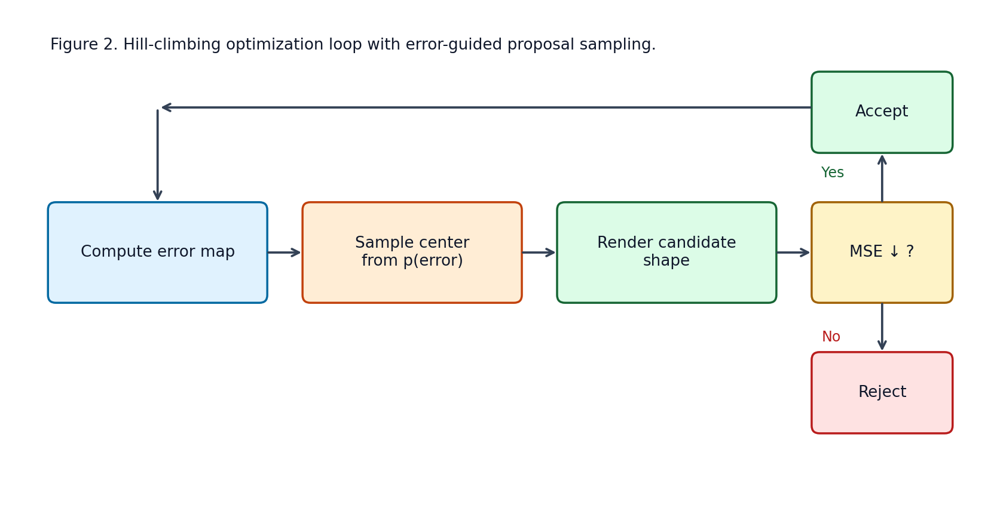

# Attention-Guided Evolutionary Art: An Academic Report

Name: Abdul Ahad  
Reg. No.: 245805010

## Abstract
This report presents a compact evolutionary image reconstruction system that approximates 100x100 RGB targets using transparent geometric primitives. The optimization algorithm is a hill-climbing search guided by a smoothed per-pixel error map. Candidate shapes are sampled more often in high-error regions, rendered with alpha blending, and accepted only if they reduce global mean squared error (MSE). A deterministic shape cycle (triangle, quadrilateral, ellipse) and a three-phase size schedule provide stable convergence and visual variety. Experiments on three targets (heart, logo, face) show monotonic error reduction and interpretable intermediate states. The implementation emphasizes reproducibility, testing, and real-time visualization.

## 1. Introduction
Generative approximation with simple primitives is a useful educational setting for optimization, rendering, and model interpretability. The system here is intentionally small but expressive:
- Small spatial resolution for fast iteration.
- Explicit objective (MSE) for measurable progress.
- Attention-guided candidate proposals for computational efficiency.

Unlike end-to-end neural reconstruction, this framework makes each accepted update visible and interpretable: every retained shape has a direct causal contribution to error reduction.

## 2. Problem Formulation
Given target image $T \in [0,1]^{H \times W \times 3}$ and current canvas $C$, optimize a sequence of shapes $\{s_k\}$ such that rendered canvas $\hat{C}$ minimizes MSE:

$$
\operatorname{MSE}(T, C) = \frac{1}{3HW}\sum_{y=1}^{H}\sum_{x=1}^{W}\sum_{c=1}^{3} (T_{y,x,c} - C_{y,x,c})^2
$$

The per-pixel error map is:

$$
E_{y,x} = \sum_{c=1}^{3}(T_{y,x,c} - C_{y,x,c})^2
$$

This map is Gaussian-smoothed and normalized to a probability distribution for proposal sampling.

## 3. System Architecture
The pipeline is modular and testable.


Core modules:
- `image_loader.py`: RGB conversion, resize, float32 normalization.
- `canvas.py`: white-canvas initialization and deep copy.
- `mse.py`: scalar MSE + raw/smoothed error maps.
- `polygon.py`: shape sampling and informed color initialization.
- `renderer.py`: rasterization and alpha compositing.
- `optimizer.py`: hill-climbing loop, scheduling, acceptance statistics.

## 4. Methodology
### 4.1 Candidate generation
Three shape types are supported:
- Triangle
- Quadrilateral (vertex-angle sorting to enforce convexity)
- Ellipse

The shape center is sampled from the current normalized error distribution, concentrating proposals in unresolved regions.

### 4.2 Color initialization
For each proposal, color is initialized from the mean target color in the shape bounding box, then perturbed with Gaussian noise ($\sigma=0.15$) and clipped to $[0,1]$.

### 4.3 Rendering model
Rasterization produces binary masks; compositing uses alpha blending:

$$
C_{new}[M] = \alpha\,\mathbf{c} + (1-\alpha)\,C[M]
$$

where $M$ is the shape mask and $\mathbf{c}$ the RGB color.

### 4.4 Optimization loop
The hill-climbing loop follows:



1. Compute/update error map.
2. Sample proposal center from $p(E)$.
3. Generate and render candidate shape.
4. Accept candidate iff MSE strictly decreases.
5. Track acceptance and snapshots.

## 5. Scheduling and Search Dynamics
### 5.1 Three-phase size schedule
For total iterations $N$:
- Phase 1 (0–30%): size decays from 30 px to 15 px.
- Phase 2 (30–70%): size decays from 15 px to 8 px.
- Phase 3 (70–100%): size decays from 8 px to 3 px.

Linear interpolation within each phase ensures smooth transitions.

### 5.2 Shape cycling
Shape type is deterministic by iteration index modulo 3:
- $k \bmod 3 = 0$: triangle
- $k \bmod 3 = 1$: quadrilateral
- $k \bmod 3 = 2$: ellipse

This guarantees early and persistent diversity.

## 6. Verification and Testing
Behavioral and unit tests verify correctness:
- `test_mse.py`:
  - white vs black MSE = 1.0
  - white vs white MSE = 0.0
  - single red pixel has maximum local error at expected location
- `test_renderer.py`:
  - center pixel changes for triangle/ellipse
  - out-of-mask corner remains white
- `test_optimizer.py`:
  - 500-step heart run reduces MSE
  - acceptance history length is correct
  - minimum accepted proposals and non-empty snapshots

## 7. Experimental Results
Full demo configuration: 5000 iterations per target.

Observed best-run statistics:
- Best target: heart
- Iterations: 5000
- Accepted polygons: 925
- Final MSE: 0.003435
- Runtime: 8.86 s

All runs produce final canvases, replay GIFs, and a comparison grid (`comparison_grid.jpg`) showing targets, reconstructions, and MSE trajectories.

## 8. Discussion
### 8.1 Strengths
- Transparent optimization process with interpretable updates.
- Efficient attention-guided proposal distribution.
- Strong visual/quantitative convergence for low-resolution targets.

### 8.2 Limitations
- Greedy acceptance can stall near local minima.
- Bounding-box color initialization is heuristic.
- Fixed alpha range and fixed schedule may not be universally optimal.

### 8.3 Potential improvements
- Multi-try acceptance per iteration (beam-style proposals).
- Adaptive sigma and/or schedule conditioned on convergence slope.
- Hybrid local refinement (small gradient-based color perturbation).

## 9. Reproducibility
Primary execution commands:

```powershell
Set-Location python
uv run python demo.py
uv run python -m pytest tests/test_mse.py tests/test_renderer.py tests/test_optimizer.py -v
```

Presentation artifacts can be regenerated from produced outputs.

## 10. Conclusion
The project demonstrates that a compact evolutionary search with error-guided attention can reconstruct images effectively while remaining interpretable and testable. The method provides a pedagogically useful bridge between classical optimization concepts and modern attention-based reasoning.

## References
1. Mitchell, M. (1998). *An Introduction to Genetic Algorithms*. MIT Press.
2. Kirkpatrick, S., Gelatt, C. D., & Vecchi, M. P. (1983). Optimization by Simulated Annealing. *Science*, 220(4598), 671-680.
3. Nocedal, J., & Wright, S. J. (2006). *Numerical Optimization* (2nd ed.). Springer.
4. Gonzalez, R. C., & Woods, R. E. (2018). *Digital Image Processing* (4th ed.). Pearson.
5. Van Rossum, G., & Drake, F. L. (2009). *Python 3 Reference Manual*. CreateSpace.
6. Hunter, J. D. (2007). Matplotlib: A 2D Graphics Environment. *Computing in Science & Engineering*, 9(3), 90-95.
7. Virtanen, P., et al. (2020). SciPy 1.0: Fundamental Algorithms for Scientific Computing in Python. *Nature Methods*, 17, 261-272.
8. Van der Walt, S., et al. (2014). scikit-image: Image processing in Python. *PeerJ*, 2:e453.
